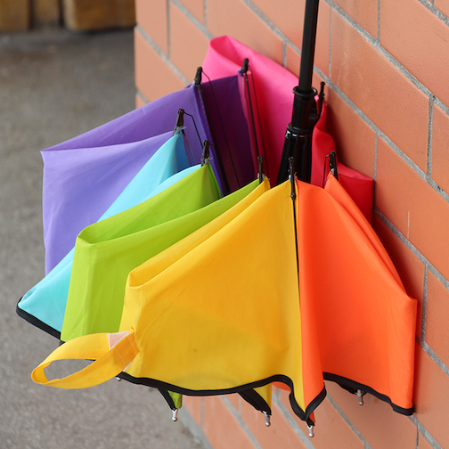
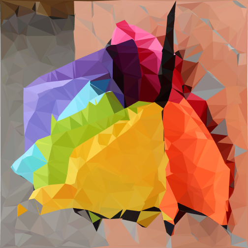

# WebGL Triangulation

Convert any image to low-poly style with **webgl** on the fly.

|    Origin     |     Result      |
| :-----------: | :-------------: |
|  |  |

the main logic is at js/index.js and shaders/

By use [Delaunay](https://github.com/ironwallaby/delaunay), a fast javascript delaunay implementation

and [CanvasToy](https://github.com/Danielhu229/CanvasToy), a simple rendering tool written by myself
